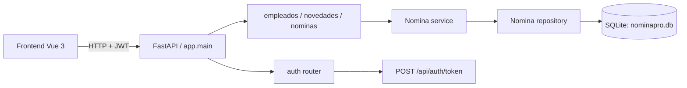
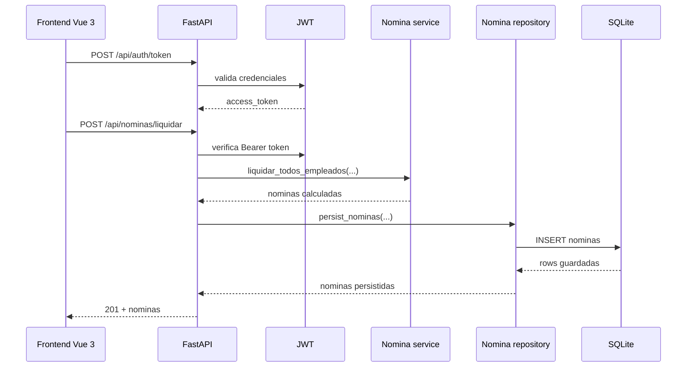

# NominaPro - Sistema de nómina Colombia 2026

NominaPro es una API + frontend para liquidar nómina con reglas de Colombia 2026.
El backend expone operaciones para empleados, novedades, parámetros y liquidación de nómina.
El frontend consume esa API y permite revisar la información desde el navegador.

## Tecnologias

- Backend: FastAPI, SQLAlchemy, Pydantic v2, SQLite.
- Seguridad: JWT con roles para proteger rutas sensibles.
- Calidad: pytest, black, isort, pre-commit.
- Frontend: Vue 3 + Vite + Pinia + Vue Router + Axios.

## Estructura del proyecto

- `backend/app/api`: rutas HTTP.
- `backend/app/services`: reglas de negocio y calculos de nomina.
- `backend/app/repositories`: acceso a datos y persistencia.
- `backend/app/db`: modelos y conexion a base de datos.
- `backend/app/core`: configuracion y autenticacion.
- `frontend/src`: app Vue, vistas y servicios HTTP.

## Arquitectura



Este flujo resume la separacion actual:

- El frontend solo consume la API.
- La API valida y protege rutas con JWT.
- El service contiene las reglas de negocio.
- El repository persiste en la base de datos.

## Flujo de liquidacion



Este flujo muestra el recorrido real de una liquidacion:

- El frontend solicita un token y luego llama a la API con `Bearer`.
- La API valida el acceso y manda el calculo al service.
- El repository solo guarda el resultado final en SQLite.

## Funcionalidades principales

- Liquidacion de nomina con reglas 2026.
- Parametrizacion dinamica de constantes legales (salud, pension, provisiones, etc.) desde la base de datos.
- Calculo de salario integral, IBC, FSP y aportes.
- Persistencia local en `nominapro.db`.
- Token JWT para proteger rutas de liquidacion y eliminacion.
- Validaciones con Pydantic y reglas de negocio en servicios.
- El backend usa variables de entorno para `SECRET_KEY`, roles demo y orígenes permitidos.

## Frontend implementado (estado real)

- Login demo con `admin/secret` contra `POST /api/auth/token`.
- Manejo de token con Pinia (`src/stores/auth.ts`) y persistencia en `localStorage`.
- Guardas de ruta en `src/router/guards.ts` para evitar acceso sin autenticación.
- Header y navegación visibles solo con sesión activa.
- Interceptor Axios en `src/services/api.ts` para enviar `Authorization: Bearer <token>`.
- Manejo automático de `401`: cierre de sesión y redirección a `/login`.
- Módulo Empleados con crear, listar y eliminar (con confirmación), formulario con layout tipo tarjeta y validación manual de salario.
- Módulo Novedades con formulario y listado.
- Módulo Nóminas con liquidación por mes, filtro por período y agrupación visual por mes y empleado.
- La vista de empleados ya no depende de controles nativos rígidos para el salario; acepta valores como `1500000` o `1.500.000` y muestra el error real que devuelve la API.
- El módulo de nóminas usa `POST /api/nominas/liquidar` para generar el período completo y luego consulta `GET /api/nominas/?periodo=YYYY-MM` para listar el historial agrupado.

## Requisitos previos

- Python 3.11 o superior.
- Node.js 18+ para el frontend.
- `pip` y `npm` disponibles en tu entorno.

## Variables de entorno

La configuración local funciona con los valores por defecto del proyecto, pero puedes copiar [`.env.example`](.env.example) a `.env` para dejarlo explícito.

- Backend: `DATABASE_URL`, `SECRET_KEY`, `DEMO_USERNAME`, `DEMO_PASSWORD`, `DEMO_ROLES`, `ALLOWED_ORIGINS`.
- Frontend: `VITE_API_URL` solo si quieres apuntar a un backend distinto del proxy local.

Recomendación de uso:

- Copia `.env.example` a `.env` y personaliza los valores antes de ejecutar el proyecto.
- No subas `.env` al control de versiones. Asegúrate de incluir `.env` en tu `.gitignore`.
- Define `SECRET_KEY` para entornos de staging/producción con una cadena larga y segura.

El proyecto está pensado para operar en modo demo local por defecto:

- Usuario: `admin`
- Clave: `secret`
- Roles: `RH_ADMIN`, `PAYROLL_USER`

Si el frontend sigue mostrando sesión de invitado, normalmente significa una de estas dos cosas:

- El backend no está levantado en la URL esperada.
- El login de demo no se envió con `admin` / `secret`.
- El navegador conserva un token viejo; en ese caso cierra sesión o borra el almacenamiento local del sitio.


## Arranque rápido (Multiplataforma)

Estas instrucciones funcionan en Windows (PowerShell o CMD), macOS y Linux (bash/zsh).

### Backend

1) Crear y activar un entorno virtual

- Windows PowerShell:

```powershell
python -m venv .venv
.\.venv\Scripts\Activate.ps1
```

- Windows CMD (si no usas PowerShell):

```cmd
python -m venv .venv
.venv\Scripts\activate.bat
```

- macOS / Linux (bash/zsh):

```bash
python -m venv .venv
source .venv/bin/activate
```

2) Instalar dependencias

```bash
pip install -r backend/requirements.txt
```

3) Ejecutar la API (desde la raíz del proyecto o dentro de `backend`)

```bash
cd backend
python -m uvicorn app.main:app --host 127.0.0.1 --port 9000
```

- Opción con recarga para desarrollo: agregar `--reload` (útil en macOS/Linux). En Windows algunas máquinas muestran `WinError 10013` con `--reload`; si ocurre, arranca sin `--reload`.

4) Verificar que la API esté disponible

Abre: http://127.0.0.1:9000/docs

### Frontend

Abrir nueva terminal y desde la carpeta `frontend`:

```bash
cd frontend
npm install
npm run dev
```

Luego abre: http://localhost:5173

Si el frontend no encuentra el backend, revisa la variable `VITE_API_URL` o usa el proxy local de Vite.

Configuración actual de desarrollo:

- `vite.config.js` tiene proxy de `'/api'` hacia `http://localhost:9000`.
- Si `VITE_API_URL` no está definida, el frontend usa `'/api'` por defecto.

### Scripts de demostración

En la raíz del proyecto hay dos scripts para demostraciones:
- `demo_api.ps1` — PowerShell (Windows).
- `demo_api.sh` — Bash (macOS/Linux). Hazlo ejecutable con `chmod +x demo_api.sh` y ejecútalo con `./demo_api.sh`.

### Uso rápido (ya implementado)

Si el proyecto ya está implementado en tu máquina (entorno creado y dependencias instaladas), usa esta guía corta para iniciar y probar sin repetir los pasos de configuración:

- Backend (desde la raíz del repo):

```powershell
# Inicia la API (usa la ruta canonical definida en .env o el valor por defecto)
python -m uvicorn backend.app.main:app --reload --port 9000
```

- Frontend (nueva terminal):

```bash
cd frontend
npm run dev
```

- Ejecutar script de demostración (Windows PowerShell):

```powershell
.\demo_api.ps1
```

- Crear `.env` desde la plantilla (si aún no existe):

```powershell
Copy-Item .env.example .env
```

- Ejecutar tests rápidos (backend):

```powershell
.venv\Scripts\python -m pytest -q
```

Usa esta sección cuando ya tengas el proyecto implementado para evitar repetir los comandos de instalación y creación del entorno.

La portada incluye un acceso de demo para obtener el token antes de usar rutas de escritura.


## Autenticacion JWT

El backend incluye un login minimo de demo para proteger rutas sensibles.
La portada tiene un formulario de acceso rapido para generar el token y mantener la sesion en el navegador.

### Obtener token

```http
POST /api/auth/token
```

Importante: este endpoint espera `application/x-www-form-urlencoded` (no JSON).

Credenciales de demo:

- Usuario: `admin`
- Clave: `secret`

La respuesta devuelve `access_token` y `token_type`.
Luego usa el header:

```http
Authorization: Bearer <token>
```

## Endpoints utiles

- `GET /api/novedades/` lista novedades. Soporta filtros por query: `?empleado_id=` y `?periodo=`.
- `GET /api/nominas/` lista nóminas persistidas. Soporta filtro por periodo: `?periodo=YYYY-MM`.
- `POST /api/auditoria/` registra eventos de auditoría (restringido a roles `RH_ADMIN`).
- `GET /api/auditoria/` lista eventos de auditoría (restringido a roles `RH_ADMIN`).

## Ejemplos de uso

- Auditoría y trazabilidad: tabla `auditoria` y endpoints para registrar/consultar eventos administrativos (acceso RH_ADMIN).

Respuesta esperada:

```json
{
	"access_token": "eyJhbGciOi...",
	"token_type": "bearer"
}
```

### Liquidar nomina

```cmd
curl -X POST http://127.0.0.1:9000/api/nominas/liquidar ^
	-H "Content-Type: application/json" ^
	-H "Authorization: Bearer eyJhbGciOi..." ^
	-d "{\"periodo\":\"2026-01\"}"
```

Respuesta esperada:

```json
[
	{
		"id": 1,
		"empleado_id": 10,
		"periodo": "2026-01",
		"total_devengado": "4250000.00",
		"total_deducido": "512000.00",
		"neto_pagar": "3738000.00"
	}
]
```

## Ejecucion de pruebas

### Backend

```cmd
.venv\\Scripts\\python -m pytest -q
```

### Frontend

```cmd
cd frontend
npm run build
```

Nota: en el estado actual del proyecto no hay script `test` configurado en `frontend/package.json`; los scripts disponibles son `dev`, `build` y `preview`.

## Recursos para Exposicion
El proyecto incluye un script interactivo y una guia para demostraciones tecnicas de la API:
- **Script**: [demo_api.ps1](file:///NominaPro/demo_api.ps1) (Ejecutar en PowerShell).
- **Guia Narrativa**: [GUIA_EXPOSICION.md](file:///NominaPro/docs/GUIA_EXPOSICION.md).

Tambien puedes ejecutar hooks de calidad con:

```cmd
.venv\\Scripts\\pre-commit run --all-files
```

## Notas de implementacion

- El arranque del backend usa `lifespan` para crear tablas al inicio.
- La liquidacion sigue el flujo router -> service -> repository.
- `NominaRepository` solo persiste; la logica de negocio vive en `nomina_service`.
- `SMMLV` y otros valores base estan centralizados en `backend/app/core/config.py`.

## Estado actual

Entrega funcional y validada para uso local.
La base de documentación, pruebas y seguridad quedó cerrada de forma consistente con el flujo descrito en `docs/implementacion.md`.
Si necesitas evolucionarlo, el siguiente paso natural es reemplazar el login de demo por usuarios reales en base de datos.
