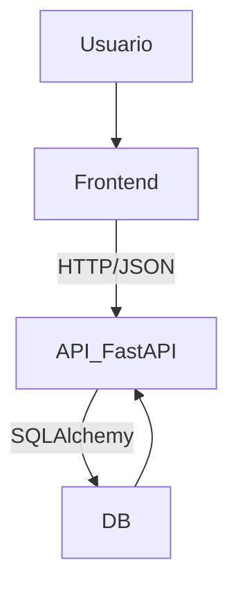
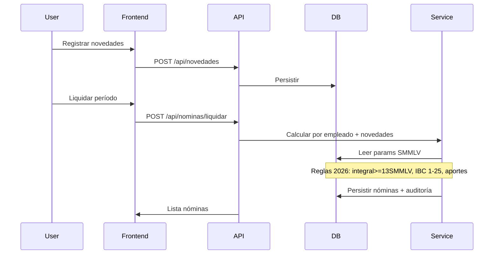

# Documentación de Arquitectura – NominaPro

## Contexto del Proyecto
- **Nombre**: NominaPro
- **Frontend**: Vue.js
- **Backend**: Python + FastAPI
- **Base de datos**: SQLite (Desarrollo Local) / PostgreSQL usando psycopg[binary] (Producción)
- **Infraestructura**: ejecución local simple y después en Kubernetes

## Visión General
Descripción del sistema de nómina **NominaPro**, enfocado en reglas 2026 (Salario Integral, DIAN, UGPP).
Arquitectura cliente-servidor con API REST.



## Estructura del Repositorio (Actual)
```
NominaPro/
├── backend/app/
│   ├── main.py
│   ├── api/ (empleados.py, nominas.py, novedades.py, parametros.py)
│   ├── db/ (models.py, session.py)
│   └── schemas.py
├── frontend/src/views/ (EmpleadosView.vue etc.)
├── docs/
├── prompts/
└── README.md
```

## Componentes del Sistema
### Frontend (Vue 3 + Vite)
SPA para empleados, novedades, nóminas. Axios a /api.

### Backend (FastAPI)
main.py arranque, routers /api/*, servicios de nómina.

### DB (SQLite local)
Modelos: Empleado, Novedad, Nomina.

## Flujo Liquidación Mensual


## Módulos
| Módulo | API Endpoint | Funcionalidad |
|--------|--------------|---------------|
| Empleados | /api/empleados | CRUD |
| Novedades | /api/novedades | Por empleado/periodo |
| Nóminas | /api/nominas | Liquidar/listar |

## Evolución Pendiente

Estado actual: MVP operativo alineado.

## Notas de alineación con el código
- **Endpoints reales:** Los routers están expuestos bajo `/api` y los endpoints actuales incluyen `POST /api/empleados/`, `GET /api/empleados/`, `POST /api/novedades/` (comportamiento *upsert*), `GET /api/novedades/`, `POST /api/nominas/liquidar`, `GET /api/nominas/` y `GET /api/nominas/{id}`.
- **Filtros sugeridos:** Aunque la arquitectura sugiere filtros por `periodo` o `empleado_id`, la implementación actual no expone `GET /api/nominas?periodo=...` ni `GET /api/novedades?empleado_id=...` — se pueden añadir si el frontend lo requiere.
- **Términos:** usar `tipo_salario` (`ORDINARIO`/`INTEGRAL`) en documentación y en la UI para mantener coherencia con `models.py` y `schemas.py`.
