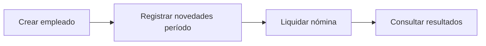

# Documentación Funcional – NominaPro

## Descripción del Sistema
NominaPro resuelve liquidación mensual de nómina colombiana 2026 para PYMEs. Alcance: empleados, novedades, liquidación.

## Módulos
### Gestión de Empleados
CRUD. Campos: nombre, documento (único), salario_base, tipo_salario ('ORDINARIO'|'INTEGRAL').

### Novedades
- POST/DELETE/GET por `novedad_id` y listado general. El endpoint `POST /api/novedades/` implementa un comportamiento *upsert*: si ya existe una novedad para `(empleado_id, periodo)` se actualiza, de lo contrario se crea.
- Nota: actualmente no existe un endpoint público dedicado que devuelva novedades filtradas por `empleado_id` y/o `periodo` (aunque el repositorio interno dispone de funciones para obtenerlas). Se recomienda añadir `GET /api/novedades?empleado_id=...&periodo=...` si se requiere filtrado desde cliente.

### Nóminas
Liquidar período: genera nóminas por empleado activo usando las novedades persistidas. `POST /api/nominas/liquidar` realiza la orquestación y persistencia.

- Nota: `GET /api/nominas/` devuelve el historial completo. Actualmente no existe un filtro por `periodo` expuesto en la API (p. ej. `GET /api/nominas?periodo=YYYY-MM`). Recomendación: añadir soporte de filtrado por `periodo` si se necesita consulta directa desde frontend.

## Reglas de Negocio
Estas reglas se calculan dinámicamente basándose en la tabla `parametros_legales` para cada vigencia.
- **Salario Integral**: >=13 SMMLV. Factor prestacional: 70%.
- **IBC**: 1-25 SMMLV.
- **Aportes**: Salud Emp 4%, Pensión Emp 4%. (Configurables en BD).
- **FSP**: >=4 SMMLV IBC. (Configurable en BD).
- **Transporte**: <2 SMMLV ordinario. (Configurable en BD).
- **Prestaciones**: Prima, Cesantías, Int. Cesantías, Vacaciones. (Porcentajes configurables en BD).
- Valor hora = salario / horas_mes (240 por defecto).
- Neto = devengado - deducciones.
- Unicidad (empleado_id, periodo).

## Flujo Principal

## Límites Actuales/Roadmap
- Autenticación: existe soporte JWT con usuario demo (`settings.DEMO_USERNAME`/`DEMO_PASSWORD`) y validación de roles (`RH_ADMIN`, `PAYROLL_USER`). Actualiza la doc si cambian las credenciales demo.
- Cálculo simplificado.
Próximo: Auditoría cambios, export PDF.

Alineado con código actual: endpoints CRUD + liquidación básica.
