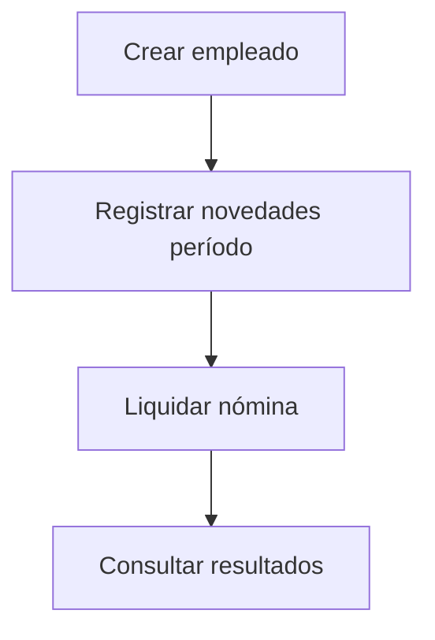

# Documentación Funcional – NominaPro

## Descripción del Sistema
NominaPro resuelve liquidación mensual de nómina colombiana 2026 para PYMEs. Alcance: empleados, novedades, liquidación.

## Módulos
### Gestión de Empleados
CRUD. Campos: nombre, documento (único), salario_base, tipo_salario ('ORDINARIO'|'INTEGRAL').

### Novedades
POST/GET/DELETE por empleado_id, periodo (YYYY-MM), tipo (HORA_EXTRA|INCAPACIDAD|DESCUENTO|BONIFICACION), valor.

### Nóminas
Liquidar período: genera por empleado activo + novedades. GET por período.

## Reglas de Negocio (R01-R14)
Estas reglas se calculan dinámicamente basándose en la tabla `parametros_legales` para cada vigencia.
- **Salario Integral (R01)**: >=13 SMMLV. Factor prestacional: 70%.
- **IBC**: 1-25 SMMLV.
- **Aportes**: Salud Emp 4%, Pensión Emp 4%. (Configurables en BD).
- **FSP (R06)**: >=4 SMMLV IBC. (Configurable en BD).
- **Transporte (R07)**: <2 SMMLV ordinario. (Configurable en BD).
- **Prestaciones (R08)**: Prima, Cesantías, Int. Cesantías, Vacaciones. (Porcentajes configurables en BD).
- Valor hora = salario / horas_mes (240 por defecto).
- Neto = devengado - deducciones.
- Unicidad (empleado_id, periodo).

## Flujo Principal

## Límites Actuales/Roadmap
- Sin JWT (pendiente).
- Cálculo simplificado.
Próximo: Auditoría cambios, export PDF.

Alineado con código actual: endpoints CRUD + liquidación básica.
